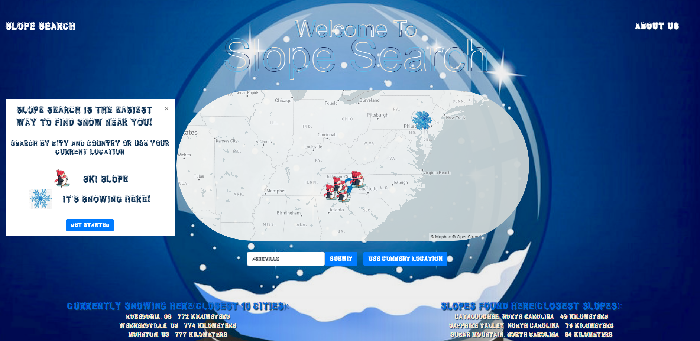

# Slope Search

## What it is

- Slope Search is an app that searches and returns locations where snow is actively falling and where ski resorts keep powder on the ground year-round.

- Using real-time data from MapBox and (), users receive a list of the closest snow to either their location or a city of their choice.

# Technologies Used To Create Slope Search

- JavaScript
- HTML5
- CSS
- BootStrap

# Contributors
- Claude Major - Project Manager github.com/ClauMaj
- Matt Philips - Data Mining github.com/jmphil
- Jacob Deel - Website Design github.com/jacoblakedeel